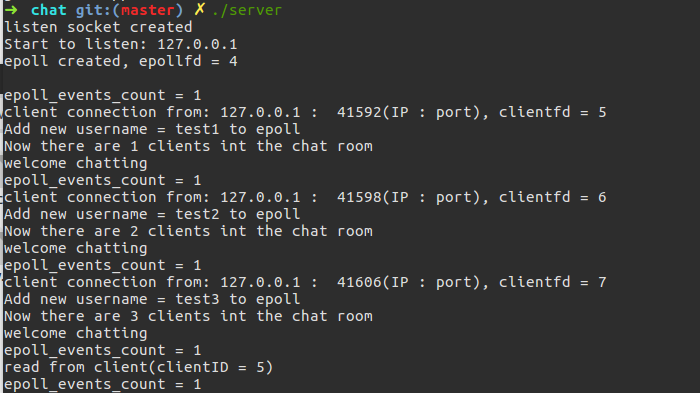
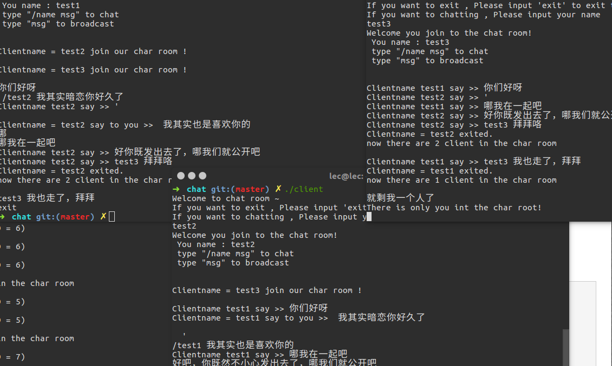
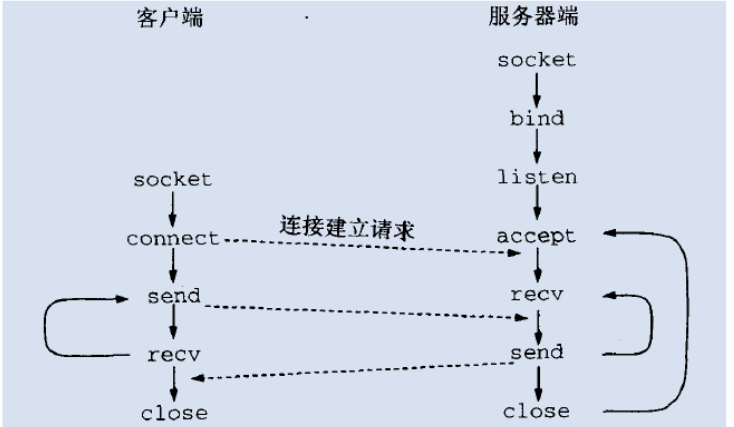

## Epoll 实现高并发聊天室

本项目是实现一个简单的聊天室，聊天室分为服务端和客户端。采用C/S模型，使用TCP连接。

### 相关技术点: 
* 服务端使用 `epoll` 实现 I/O 多路复用，响应事件发生。边缘模式，端口复用，非阻塞方式读。
* 客户端使用 `fork` 创建两个进程，一个为写进程，负责用户写入数据，一个为读进程，负责将子进程写入的数据发送给服务端，并读出服务端发送过来的信息。

### 相关项目功能：
* 支持多个用户接入，实现聊天室的基本功能，可以点对点聊天。
* 提示输入昵称，确定之后可以进入聊天室
* 输入/name msg可以发送消息msg给昵称为name的用户
* 其它任意字符则为群发
* 任一用户下线或者上线其它用户都会接收到通知.

### 服务器运行效果 :

### 客户端运行效果图：

### 系统调用使用顺序：

### Envoirment
* OS : Ubuntu 16.04 
* Complier : g++ 5.4.0

**附相关学习过程的资料**

[epoll实现高并发聊天室](https://blog.csdn.net/qq_31564375/article/details/51581038)  
[Linux下的I/O复用与epoll详解](https://www.cnblogs.com/lojunren/p/3856290.html)  
[ 彻底学会使用epoll](http://blog.chinaunix.net/uid/28541347/cid-191916-list-3.html)  